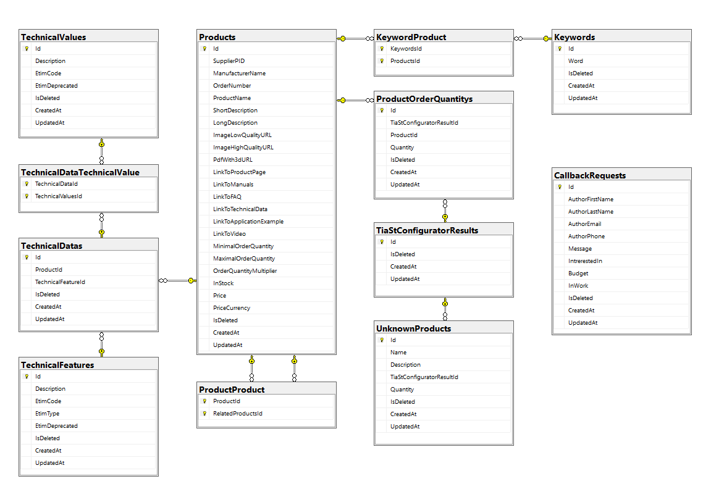

# MikartEnergy

**This is my pet project.  
I decided to create the website of a fictitious company that automates production processes in the chemical industry and sells industrial automation components.**

## Extravagant technologies of this project that you won't find in any other Pet project:

- [ETIM](https://www.etim-international.com/) - the international classification standard for technical products. 
In short, the ETIM standardises the format in which equipment manufacturers provide detailed information about their products to distributors and partners. The ETIM also classifies the technical characteristics and parameters of the products. More details in the short official video [ETIM INTERNATIONAL Simpleshow](https://youtu.be/I1lp5QtDL5g?si=b8BfXdoHEKjjznqD).
In this project I use ETIM xml file with information about Siemens automation products (PLC S7-1500 and HMI Comfort). And file with information about ETIM Features and ETIM Values classes which I get using my own application. I have created a separate [ETIM-API-Saver](https://github.com/OleksiiPrykhodko/ETIM-API-Saver) application to receive ETIM Features and ETIM Values classes from ETIM API and save it to the XML file.

- [ELBRIDGE Interface](https://www.itek.de/en/beratung/standardisierung/elbridge/) - standard developed by ETIM Germany to connect wholesale shops to the product configurators of the industry. The interface technically standardizes the product selection process.
In brief, it is a standard according to which equipment manufacturers create their own web configurators, which can be further integrated into the partner's site for quick and error-free selection of equipment and transfer of created specifications to the order list on the partner's web shop. 
In my project this is used to select equipment from the Siemens catalogue. And adding the result to the order list. 

- [TIA Selection Tool](https://siemens.com/tst) - worldwide configurator of Siemens automation products wich uses ELBRIDGE Interface for passing the configuration result to the order list of the distributor's website.

## Technologies:

### Backend:
  - [.NET 7](https://dotnet.microsoft.com/download)
  - [ASP.NET Core Web API](https://dotnet.microsoft.com/en-us/apps/aspnet/apis)
  - [Entity Framework Core](https://docs.microsoft.com/ef/core)
  - [FluentValidation](https://github.com/JeremySkinner/FluentValidation)
  - [Serilog](https://serilog.net/)
  - [ELBRIDGE Interface](https://www.itek.de/en/beratung/standardisierung/elbridge/)
  - [ETIM](https://etimapi.etim-international.com/)

### Frontend:
- [Angular](https://angular.io/docs)
- [Bootstrap 5.2](https://getbootstrap.com/docs/5.2/getting-started/introduction/)
- [PrimeNG 17.3](https://primeng.org/installation)
- [Font Awesome](https://fontawesome.com/)
- [TIA Selection Tool - Siemens embedded configurator](https://www.siemens.com/global/en/products/automation/topic-areas/tia/tia-selection-tool.html)

### DerOps:
- [Docker](https://www.docker.com/)

## Startup project in docker with YAML file
0) Run command `npm install` in main frontend directory (MikartEnergy\frontend) with PowerShell or Command Prompt. This is necessary to run the frontend project in development mode.

1) Configure your production network to send HTTP requests to port 55580 and HTTPS requests to port 55443. Ports can be changed in docker-compose.yml file (in reverse-proxy service config).
2) Copy the "DockerVolumes" directory with its contents to the C drive root (C:\DockerVolumes). This directory is for docker volumes.  
The database and ssl certificate will be created in this directory when the containers are first time started. It directory already contains needed https development certificate for backend service (install it on your OS). 
3) Start up Docker.
4) Change the value of "apiUrl" field in "MikartEnergy\frontend\src\environments\environment.ts" to your domain name. 
5) If you have created an SSL certificate for your domain name using Letsencrypt and Certbot, you should jump to point 6. If not, then:
51) temporarily replace the contents of the "MikartEnergy\reverse-proxy\nginx.conf" file with the contents of the "MikartEnergy\reverse-proxy\Nginx configuration for new ssl certificate.txt" file.
52) comment out the "entrypoint:" line and remove commenting of the "command:" line (enter the correct domain name and email) in docker-compose.yml file.
53) run command `docker-compose -p certificate-creation up` in main directory of App (with docker-compose.yml file). If everything is correct, Certbot will create a certificate in the docker volumes folder and container will be stoped without errors. You can find folder with certificates in "C:\DockerVolumes\MikartEnergy\Certbot\conf\live".
54) stop all running containers and delete them. 
55) replace the contents of the "MikartEnergy\reverse-proxy\nginx.conf" file with the contents of the "MikartEnergy\reverse-proxy\Nginx production configuaration" file.
56) comment back "command:" line and uncomment "entrypoint:" line in docker-compose.yml file.
6) Run command `docker-compose -p mikartenergy up` in main directory of App (with docker-compose.yml file).
7) Open your domane name in your browser. 
8) I hope everything works! 

### Frontend Development server
Run `ng serve` for a dev server. Navigate to `http://localhost:4200/`. The application will automatically reload if you change any of the source files.
### Frontend Build
Run `ng build` to build the project. The build artifacts will be stored in the `dist/` directory.

## MikartEnergy database diagram

